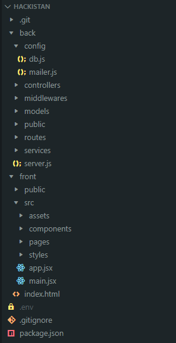

# Hackistan

## Description

Hackistan est un projet réalisé durant le Hackathon organisé par l'AFEC du 9 février au 13 février 2026 par Doriane, David, Maxime, Cassandra (et Pyerre parce qu'il sait pas écrire son prénom).

Le projet consiste en un forum où les utilisateurs peuvent discuter de sujets construit sur une API REST.

## Technologies utilisées

- REACT/VITE
- Express/Nodejs
- SQL/mySQL

## Conventions

- Convention de nommage : camelCase
- Tabulation : 4 spaces

## Architecture

- 2 fichiers séparés : Back-end et Front-end

L'architecture est la suivante :

## EndPoint

v.1

// Discution

- GET localhost://3000/discutions
- GET localhost://3000/discutions/:id
- GET localhost://3000/discutions/count
- POST localhost://3000/discutions //isUser

// Post

- GET localhost://3000/posts/pending //isAdmin
- GET localhost://3000/posts/count/:id
- GET localhost://3000/posts/discution/:id
- POST localhost://3000/posts //isUser

// Tag

- GET localhost://3000/tags
- GET localhost://3000/tags/discution/:id
- POST localhost://3000/tags //isAdmin

// User

- GET localhost://3000/users //isAdmin
- GET localhost://3000/users/:id //isAdmin
- GET localhost://3000/userProfile //isUser

// Authentification

- GET localhost://3000/verify
- POST localhost://3000/login
- POST localhost://3000/register

## Librairies/Dependencies

### Dépendances back-end

- dotenv
- argon2
- express
- mysql2
- jsonwebtoken
- jwt-decode
- nodemailler
- obscenity

### Dépendances front-end

- axios
- react-icon
- js-cookie
